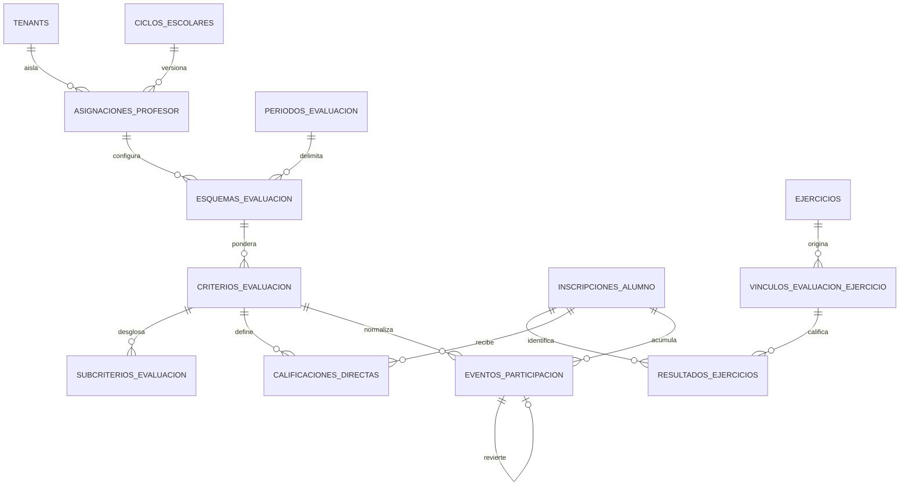

# Modelo de fuentes de calificación — Paso 5

## Regla de autoridad

Toda nota se representa en escala `0–10` mediante `numeric(6,4)`. Un estado
distinto de `calificado` no puede contener nota. `resultados_ejercicios.calificacion`
es la única autoridad para ejercicios; `calificacion_manual` permanece únicamente
como espejo de compatibilidad y el trigger impide que diverja.

## Fuentes y adaptadores

| Fuente | Persistencia canónica | Nota | Estados relevantes |
|---|---|---:|---|
| `automaticExercise` | `resultados_ejercicios` + vínculo | 0–10 | `calificado` |
| `descriptiveSubmission` | `resultados_ejercicios` + vínculo | nula hasta calificar | `entregado`, `tardio`, `calificado` |
| `directCriterion` | `calificaciones_directas` | 0–10 sólo al calificar | siete estados canónicos |
| `participation` | `eventos_participacion` append-only | ratio 0–1, no nota | registro/reversa |

Los adaptadores están en `src/lib/academic-grading/source-adapters.ts`. El
motor ponderado que convertirá ratios y fuentes a una calificación final sigue
fuera de alcance hasta los pasos posteriores.

## Invariantes relacionales

- Todas las relaciones académicas incluyen `tenant_id`; ciclo, asignación,
  periodo, inscripción, criterio y ejercicio deben coincidir.
- Un ejercicio sólo puede corresponder a una asignación dentro del mismo
  periodo. Esto elimina la ambigüedad de ejercicios sincronizados.
- Un resultado canónico es único por inscripción y vínculo.
- Una nota directa es única por inscripción, criterio y subcriterio, y no puede
  crearse si ese criterio/subcriterio tiene un ejercicio activo.
- Los eventos de participación sólo admiten puntos positivos. Una corrección es
  otro evento `reversa` que replica exactamente el original.
- `meta_fija` exige meta mayor que cero. `maximo_grupo` calcula el máximo del
  grupo o usa `maximo_computable`; denominador cero produce `0` o exclusión
  según la regla persistida.

## Lecturas y seguridad

`vista_fuentes_calificacion` y `vista_participacion_normalizada` usan
`security_invoker=true`; nunca eluden RLS. Alumnos leen sólo sus filas,
profesores sólo sus asignaciones y administradores sólo su tenant activo.
`authenticated` no puede escribir `resultados_ejercicios`: el backend validado
lo hace con servicio; el alumno jamás edita una nota. No existe acceso `anon`.

## Transición y rollback

Las filas existentes al aplicar la migración quedan marcadas
`registro_legacy=true`, se normalizan determinísticamente desde 0–100 a 0–10 y
no se eliminan. El Paso 14 realizará su enlace definitivo. Para rollback antes
del corte basta volver a las lecturas antiguas y dejar las tablas/columnas
nuevas sin uso; nunca se borran resultados ni eventos. La reversión transaccional
del DDL fue probada en un contenedor desechable.

## Conciliación remota de sólo lectura (2026-08-26)

- Ejercicios: 6.
- Ejercicios descriptivos: 1.
- Resultados históricos: 0.
- Grupos repetidos de `sync_id` dentro del mismo tenant: 0.
- Notas remotas fuera de 0–10: 0.

La migración no fue aplicada al proyecto remoto; el corte permanece reservado
para el Paso 14.
